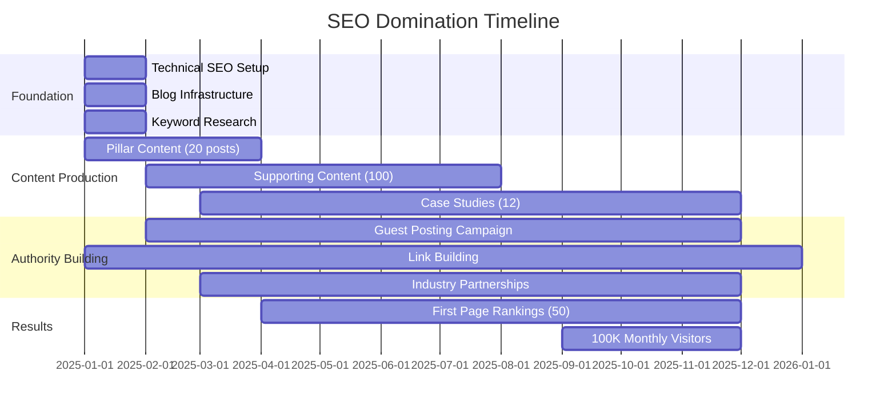
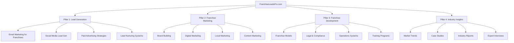
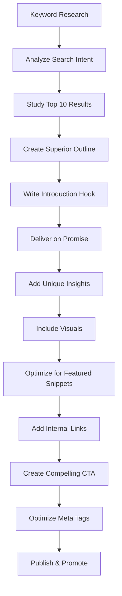
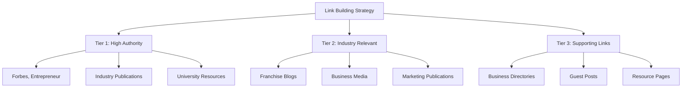
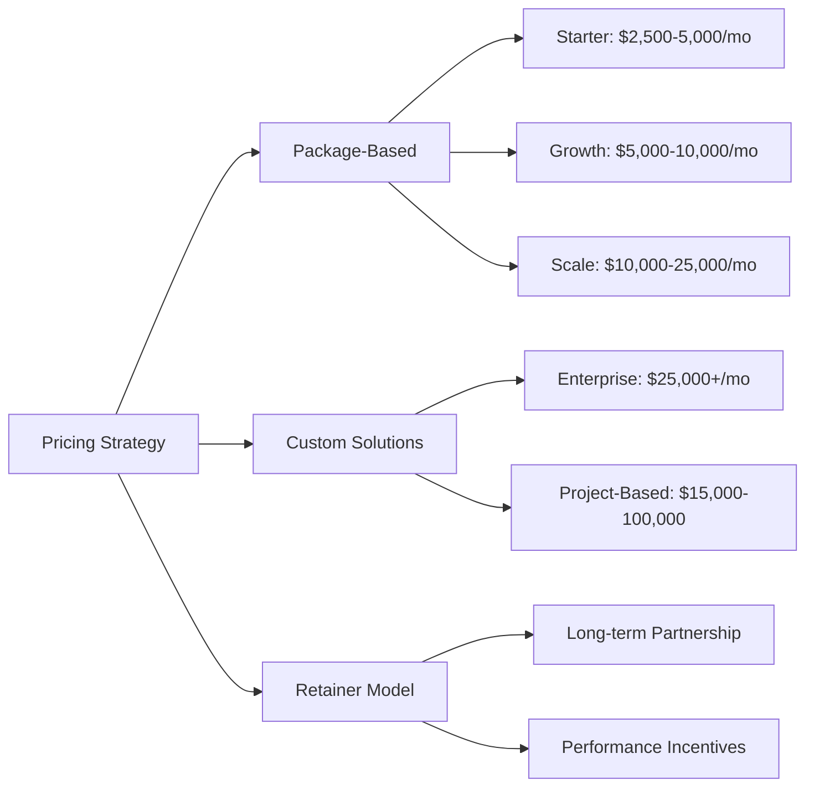
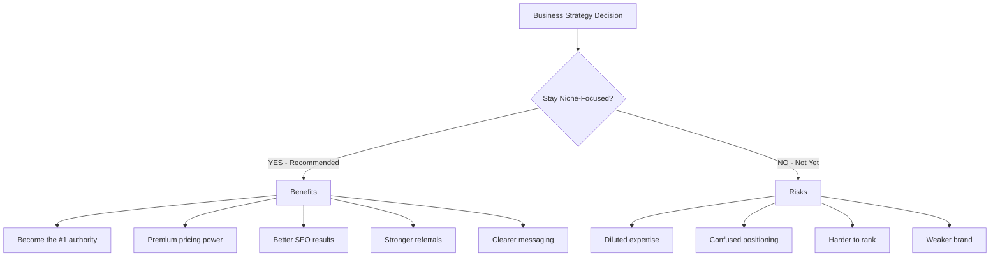
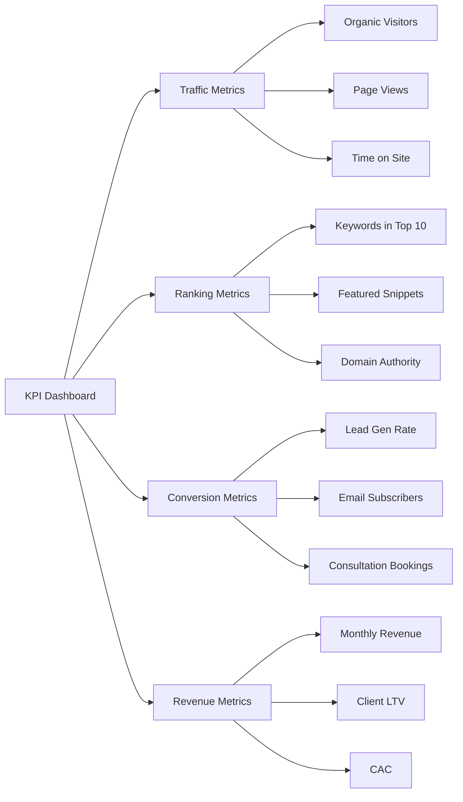
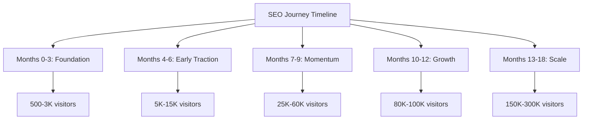

# 🚀 SEO DOMINATION PLAN - FRANCHISELEADSPRO
## Complete Strategy to Become #1 in Franchise Marketing

---

## 📋 TABLE OF CONTENTS

1. [Executive Summary](#executive-summary)
2. [12-Month SEO Timeline](#12-month-timeline)
3. [Content Strategy](#content-strategy)
4. [Blog Writing Framework](#blog-writing-framework)
5. [Link Building Strategy](#link-building-strategy)
6. [Pricing Strategy](#pricing-strategy)
7. [Business Focus](#business-focus)
8. [Implementation Checklist](#implementation-checklist)
9. [KPIs & Metrics](#kpis-metrics)
10. [Tools & Resources](#tools-resources)

---

## 🎯 EXECUTIVE SUMMARY

**Goal:** Achieve top 1% ranking for franchise-related keywords and attract millions of organic visitors within 12-18 months.

**Target Keywords:** 500+ franchise-related keywords
**Target Traffic:** 100K+ monthly organic visitors by Month 12
**Target Domain Authority:** 60+ within 18 months
**Revenue Target:** $500K+ annually from organic leads

**Core Strategy:**
- Publish 200+ high-quality blog posts in Year 1
- Build 500+ high-quality backlinks
- Establish thought leadership through LinkedIn and guest posting
- Create 50+ downloadable resources (lead magnets)
- Dominate "People Also Ask" and featured snippets

---

## 📊 12-MONTH SEO TIMELINE & MILESTONES

### Month-by-Month Breakdown



### Detailed Monthly Goals

| Month | Content Output | Link Building | Traffic Goal | Ranking Goal |
|-------|---------------|---------------|--------------|--------------|
| **Month 1** | 8 pillar posts (3000+ words) | 10 backlinks | 500 visitors | 20 keywords in top 100 |
| **Month 2** | 12 blog posts + 4 guides | 20 backlinks | 1,500 visitors | 50 keywords in top 100 |
| **Month 3** | 16 blog posts + 2 case studies | 30 backlinks | 3,000 visitors | 100 keywords in top 100 |
| **Month 4** | 20 blog posts + 4 guides | 40 backlinks | 5,000 visitors | 30 keywords in top 50 |
| **Month 5** | 20 blog posts + 2 case studies | 50 backlinks | 8,000 visitors | 50 keywords in top 50 |
| **Month 6** | 20 blog posts + 4 guides | 60 backlinks | 15,000 visitors | 20 keywords in top 10 |
| **Month 7** | 20 blog posts + 2 case studies | 70 backlinks | 25,000 visitors | 30 keywords in top 10 |
| **Month 8** | 20 blog posts + 4 guides | 80 backlinks | 40,000 visitors | 50 keywords in top 10 |
| **Month 9** | 20 blog posts + 2 case studies | 90 backlinks | 60,000 visitors | 75 keywords in top 10 |
| **Month 10** | 16 blog posts + optimization | 100 backlinks | 80,000 visitors | 100 keywords in top 10 |
| **Month 11** | 16 blog posts + optimization | 110 backlinks | 90,000 visitors | 125 keywords in top 10 |
| **Month 12** | 12 blog posts + optimization | 120 backlinks | 100,000+ visitors | 150 keywords in top 10 |

### Key Milestones

✅ **Month 3:** First featured snippet
✅ **Month 4:** First page 1 ranking for competitive keyword
✅ **Month 6:** Domain Authority 40+
✅ **Month 8:** 10 keywords in position #1-3
✅ **Month 9:** Featured in major franchise publication
✅ **Month 12:** 100K monthly organic visitors

---

## 🎯 CONTENT STRATEGY

### Content Pillar Architecture



### Content Types & Distribution

| Content Type | Quantity/Month | Word Count | Purpose |
|-------------|----------------|------------|---------|
| **Pillar Articles** | 2 | 4,000-6,000 | Comprehensive guides, cornerstone content |
| **Blog Posts** | 12-16 | 1,500-2,500 | Target specific long-tail keywords |
| **Case Studies** | 2 | 2,000-3,000 | Demonstrate results, build trust |
| **Guides/eBooks** | 2-4 | 3,000-5,000 | Lead magnets, authority building |
| **Industry Reports** | 1 | 2,000-4,000 | Original research, link magnets |
| **How-To Tutorials** | 4 | 1,200-2,000 | Answer specific questions, quick wins |
| **Comparison Posts** | 2 | 1,800-2,500 | High commercial intent keywords |
| **Listicles** | 4 | 1,500-2,000 | Shareable, easy to consume |

### Content Calendar Example

**Week 1:**
- Monday: Pillar Article - "Complete Guide to Franchise Lead Generation 2025"
- Wednesday: Blog Post - "10 Proven Email Sequences for Franchise Leads"
- Friday: Case Study - "How XYZ Franchise Generated 500 Leads in 90 Days"

**Week 2:**
- Monday: How-To Guide - "Step-by-Step: Setting Up Facebook Ads for Franchises"
- Wednesday: Comparison Post - "Franchise CRM Software: Top 10 Compared"
- Friday: Industry Report - "Q1 2025 Franchise Industry Trends"

**Week 3:**
- Monday: Blog Post - "15 Franchise Marketing Mistakes (And How to Avoid Them)"
- Wednesday: Tutorial - "How to Create a Franchise Discovery Day That Converts"
- Friday: Listicle - "25 Best Franchise Opportunities in 2025"

**Week 4:**
- Monday: Pillar Article - "Ultimate Franchise Marketing Strategy Playbook"
- Wednesday: Blog Post - "Franchise SEO: The Complete Technical Guide"
- Friday: eBook Release - "The Franchise Developer's Toolkit"

---

## ✍️ BLOG WRITING FRAMEWORK (SEO-Optimized)

### The Perfect SEO Blog Structure



### 1. Pre-Writing Research (60 minutes)

**Step 1: Keyword Selection**
- Use Ahrefs, SEMrush, or Google Keyword Planner
- Target keywords with: 500+ monthly searches, KD < 40 for new sites
- Find long-tail variations (e.g., "how to generate franchise leads in USA")

**Step 2: Analyze Top 10 Results**
- Read all top 10 articles completely
- Note what they cover (create content checklist)
- Identify gaps and weaknesses
- Find opportunities to add unique value

**Step 3: Search Intent Analysis**
- Informational: "What is franchise marketing?"
- Commercial: "Best franchise lead generation services"
- Transactional: "Hire franchise marketing agency"
- Navigational: "FranchiseLeadsPro services"

### 2. Content Structure (The Winning Formula)

```
📝 BLOG POST TEMPLATE

[TITLE - Include Target Keyword]
- 55-60 characters
- Include power words (Ultimate, Complete, Proven, Step-by-Step)
- Front-load with keyword

[META DESCRIPTION - 155 characters]
- Include primary keyword naturally
- Add compelling benefit
- Include call-to-action

[INTRODUCTION (150-200 words)]
- Hook with surprising stat or question
- Address reader's pain point
- Preview what they'll learn
- Include target keyword in first 100 words

[TABLE OF CONTENTS]
- Clickable links to H2 sections
- Improves user experience
- Helps Google understand structure

[MAIN CONTENT]

H2: Primary Subtopic 1 (Include keyword variation)
- 300-500 words
- Include specific examples
- Add bullet points or numbered lists
- Include relevant statistics

H2: Primary Subtopic 2
- 300-500 words
- Include case study or real example
- Add supporting images or screenshots
- Answer "People Also Ask" questions

H2: Primary Subtopic 3
- 300-500 words
- Include actionable tips
- Add comparison tables if relevant
- Link to related internal content

[FAQ SECTION - Schema Optimized]
- Answer 5-10 common questions
- Use FAQ schema markup
- Target featured snippet opportunities
- Keep answers 40-60 words

[CONCLUSION (150-200 words)]
- Summarize key takeaways
- Restate main benefit
- Include strong call-to-action
- Link to related resources

[CALL-TO-ACTION BOX]
- Specific offer (free consultation, guide download)
- Clear benefit statement
- Prominent button
- Low-friction conversion

[AUTHOR BIO]
- Credibility markers
- Relevant expertise
- Link to author profile
- Personal photo
```

### 3. On-Page SEO Optimization Checklist

✅ **Title Tag:**
- 55-60 characters
- Include target keyword near beginning
- Add brand name at end
- Example: "Franchise Lead Generation: 15 Proven Strategies (2025 Guide) | FranchiseLeadsPro"

✅ **URL Structure:**
- Short and descriptive
- Include target keyword
- Use hyphens, not underscores
- Example: `/blog/franchise-lead-generation-strategies-2025`

✅ **Headings Hierarchy:**
- Single H1 (title only)
- Multiple H2s (main sections)
- H3s for subsections
- Include keywords in 60% of headings

✅ **Keyword Optimization:**
- Primary keyword: 3-5 times (0.5-1% density)
- Keyword in first paragraph
- Keyword in at least one H2
- Keyword variations throughout
- LSI keywords (related terms) naturally integrated

✅ **Content Length:**
- Informational: 2,000-3,000 words
- Commercial: 1,500-2,500 words
- Pillar content: 4,000-6,000 words
- Always longer than top 3 competitors

✅ **Internal Linking:**
- 5-10 internal links per post
- Link to pillar content
- Use descriptive anchor text
- Link to related blog posts
- Create topic clusters

✅ **External Linking:**
- 2-5 authoritative external links
- Link to statistics sources
- Link to industry publications
- Link to research studies
- Adds credibility and context

✅ **Media Optimization:**
- Custom featured image (1200x630px)
- 3-5 supporting images
- Alt text with keywords
- Compressed file sizes (<100KB)
- Descriptive file names

✅ **Schema Markup:**
- Article schema
- FAQ schema
- HowTo schema (for tutorials)
- BreadcrumbList schema
- Organization schema

✅ **Engagement Elements:**
- Jump links in TOC
- Highlight boxes for key points
- Pull quotes for emphasis
- Comparison tables
- Interactive elements (calculators, quizzes)

### 4. Content Quality Guidelines

**E-E-A-T Optimization (Experience, Expertise, Authoritativeness, Trust):**

1. **Experience:**
   - Include real client results
   - Share personal insights from working with franchises
   - Reference specific campaigns you've run
   - Add "Author's Note" boxes with personal experience

2. **Expertise:**
   - Cite industry statistics and research
   - Reference authoritative sources
   - Include expert quotes
   - Demonstrate deep knowledge of franchise industry

3. **Authoritativeness:**
   - Author bio with credentials
   - Company background and track record
   - Client testimonials inline
   - Awards and recognition

4. **Trust:**
   - Accurate, fact-checked information
   - Transparent about limitations
   - Regular content updates
   - Clear contact information
   - Privacy policy and disclaimers

**Content Freshness Strategy:**
- Update top posts every 6 months
- Add new statistics and examples
- Update publication date when substantially revised
- Add "Last Updated" timestamp
- Monitor for outdated information

### 5. Featured Snippet Optimization

**Target These Snippet Types:**

1. **Paragraph Snippets (Most Common)**
```
What is franchise lead generation?
Franchise lead generation is the process of attracting and capturing 
potential franchisee prospects who are interested in investing in a 
franchise opportunity. This involves marketing strategies like content 
marketing, paid advertising, and lead magnets to build a pipeline of 
qualified candidates.
```

2. **List Snippets**
```
Steps to generate franchise leads:
1. Define your ideal franchisee profile
2. Create targeted content marketing campaigns
3. Implement lead capture systems
4. Nurture leads through email sequences
5. Qualify prospects through discovery calls
```

3. **Table Snippets**
| Lead Generation Method | Cost | Timeline | Conversion Rate |
|----------------------|------|----------|----------------|
| Content Marketing | Low | 6-12 months | 2-5% |
| Paid Advertising | High | Immediate | 1-3% |
| Referrals | Low | Ongoing | 10-20% |

4. **Video Snippets**
- Create YouTube videos for each pillar post
- Embed in blog posts
- Add video schema markup
- Include transcripts

---

## 🔗 LINK BUILDING STRATEGY

### Link Building Hierarchy



### Monthly Link Building Targets

| Month | Total Links | High Authority (DA 60+) | Medium Authority (DA 40-59) | Industry Relevant |
|-------|-------------|------------------------|----------------------------|-------------------|
| 1-3 | 60 | 5 | 15 | 40 |
| 4-6 | 120 | 10 | 30 | 80 |
| 7-9 | 150 | 20 | 45 | 85 |
| 10-12 | 170 | 30 | 60 | 80 |

### Link Building Tactics (Ranked by Priority)

#### 1. Guest Posting (Highest Priority)

**Target Publications:**
- Entrepreneur.com
- Forbes Small Business
- Inc.com
- Franchise Times
- Franchise Business Review
- QSR Magazine
- Fast Casual
- Restaurant Business Online
- Small Business Trends
- Business.com

**Guest Post Process:**
1. Identify 100 target sites (DA 40+)
2. Research their content and style
3. Create personalized pitch (not template)
4. Offer 3 unique topic ideas
5. Write exceptional content (2,000+ words)
6. Include 1-2 contextual links
7. Promote published article
8. Build relationship for future posts

**Outreach Template:**
```
Subject: Guest Post Idea: [Specific Topic] for [Publication Name]

Hi [Editor Name],

I'm [Your Name], founder of FranchiseLeadsPro, and I've been following 
[Publication Name] for [specific reason - mention recent article].

I noticed you recently published [specific article]. I'd love to contribute 
a complementary piece that your audience would find valuable.

Here are 3 topics I could write about:

1. [Specific, compelling title with data/unique angle]
2. [Specific, compelling title with data/unique angle]
3. [Specific, compelling title with data/unique angle]

I've previously been featured in [credible publications] and have [specific 
credentials]. Here's a sample of my writing: [link to best article]

Would any of these topics interest your readers?

Best regards,
[Your Name]
[Title]
[Website]
```

#### 2. Original Research & Data (Link Magnet)

**Create Annual Industry Reports:**
- "State of Franchise Marketing 2025"
- "Franchise Lead Generation Benchmark Report"
- "Franchise Industry Trends Survey"

**Promotion Strategy:**
- Press release to franchise media
- Outreach to journalists (use HARO, Qwoted)
- Share on LinkedIn with infographics
- Create embeddable assets
- Follow up with sites that cover similar data

**Expected Results:**
- 30-50 high-quality backlinks per report
- Media mentions and coverage
- Social media shares
- Industry authority boost

#### 3. Resource Page Link Building

**Find Resource Pages:**
- Google search: "franchise resources" + "helpful links"
- "franchise marketing" + "recommended reading"
- "small business resources" intitle:"resources"

**Outreach Process:**
1. Find 200 resource pages in franchise/business niche
2. Check if your content fits
3. Personalized outreach email
4. Offer value beyond just getting link

**Template:**
```
Subject: Resource suggestion for [Their Page Title]

Hi [Name],

I came across your excellent resource page on franchise marketing and 
noticed you link to [specific resource they have].

I recently published a comprehensive guide on [topic] that your audience 
might find helpful: [URL]

It covers [specific valuable points] with [unique data/case studies].

Would you consider adding it to your resources page? Happy to return the 
favor if you have content that would benefit my audience.

Either way, thanks for curating such valuable resources!

Best,
[Your Name]
```

#### 4. Broken Link Building

**Process:**
1. Use Ahrefs or Check My Links extension
2. Find broken links on franchise/business sites
3. Have replacement content ready (or create it)
4. Reach out to webmaster

**Template:**
```
Subject: Broken link on [Page Title]

Hi [Name],

I was researching franchise marketing and found your article "[Title]" 
really helpful.

I noticed one of the links appears to be broken: [URL that's broken]

I actually have a similar resource that could be a good replacement: [Your URL]

It covers [similar topics to broken link] with [unique value adds].

Hope this helps! Keep up the great work on [Website Name].

Best,
[Your Name]
```

#### 5. Digital PR & Journalist Outreach

**Daily Actions:**
- Respond to 3-5 HARO queries (Help A Reporter Out)
- Monitor Qwoted for journalist requests
- Check #JournoRequest on Twitter
- Set up Google Alerts for franchise news

**Your Expert Topics:**
- Franchise lead generation strategies
- Franchise marketing trends
- Franchise development best practices
- Franchise industry statistics
- Multi-unit franchise operations

**HARO Response Template:**
```
Subject: Expert Source: [Their Query Topic]

[BRIEF INTRO - 1 sentence about your credentials]

[DIRECT ANSWER - 2-3 paragraphs addressing their specific question]

[KEY QUOTE - 1-2 sentences they can directly quote]

[SUPPORTING DATA - Any relevant statistics or case study results]

[CREDENTIALS]
Name: [Your Name]
Title: Founder & CEO, FranchiseLeadsPro
Website: FranchiseLeadsPro.com
Background: [Specific relevant experience - 1 sentence]
Previous Features: [Publications you've been in]

Happy to provide additional insights or quotes if needed.
```

#### 6. Podcast Appearances

**Target Podcasts:**
- Franchise podcasts (franchise-specific shows)
- Marketing podcasts (broader business audience)
- Entrepreneurship podcasts (general business)

**Monthly Goal:** 2-4 podcast appearances

**Pitch Process:**
1. Listen to 2-3 episodes
2. Identify unique angle you can offer
3. Send personalized pitch
4. Prepare 3-5 key stories/insights
5. Ask for backlink in show notes

#### 7. Strategic Partnerships

**Partner Types:**
- Franchise consultants
- Franchise attorneys
- Business brokers
- CRM software companies
- Marketing tools (complementary, not competitive)

**Partnership Benefits:**
- Guest blog exchanges
- Co-created content (webinars, guides)
- Resource page links
- Newsletter mentions
- Joint case studies

#### 8. Comment Marketing (Use Sparingly)

**DO:**
- Add genuinely helpful insights
- Answer questions in the post
- Build relationships with blog authors
- Use your real name
- Link only when highly relevant

**DON'T:**
- Leave generic comments ("Great post!")
- Always include your link
- Self-promote excessively
- Use automated tools
- Comment just for the link

**Good Comment Example:**
```
"Great insights on franchise marketing ROI. We've found that tracking 
cost-per-qualified-lead rather than just cost-per-lead is crucial for 
franchisors. In our experience with 50+ franchise brands, those who focus 
on lead quality over quantity see 3x better conversion rates to signed 
franchise agreements.

One additional tip: Implement a lead scoring system to identify which 
marketing channels attract prospects who not only inquire but also have 
the capital requirements and cultural fit for your franchise system."
```

### Link Building Monthly Workflow

**Week 1: Research & Outreach**
- Identify 50 link opportunities
- Craft personalized outreach emails
- Send 20 guest post pitches
- Respond to 5 HARO queries

**Week 2: Content Creation**
- Write 2 guest posts
- Create linkable asset (infographic/report)
- Update existing content for outreach
- Respond to 5 HARO queries

**Week 3: Relationship Building**
- Follow up on outreach emails
- Engage with target sites on social media
- Comment on industry blogs
- Respond to 5 HARO queries

**Week 4: Analysis & Scaling**
- Track link acquisitions
- Analyze what's working
- Double down on successful tactics
- Respond to 5 HARO queries

---

## 💰 PRICING STRATEGY

### Service Pricing by Region



### Detailed Pricing by Market

#### 🇺🇸 USA Market (Primary Target)

| Package | Monthly Retainer | Services Included | Ideal Client |
|---------|-----------------|-------------------|--------------|
| **Starter** | $3,500-$5,000 | Lead generation setup, basic marketing, 10-20 leads/month | New franchisors (1-10 units) |
| **Growth** | $7,500-$12,000 | Full marketing suite, 30-50 leads/month, CRM setup | Established franchisors (10-50 units) |
| **Scale** | $15,000-$25,000 | Comprehensive strategy, 50-100+ leads/month, multi-channel | Growing franchises (50-100 units) |
| **Enterprise** | $30,000-$50,000+ | Custom solutions, unlimited leads, dedicated team | Major franchises (100+ units) |

**Project-Based Pricing (USA):**
- Franchise Marketing Strategy: $10,000-$25,000
- Complete Brand Development: $15,000-$40,000
- Franchise Development Package: $25,000-$60,000
- Lead Generation System Setup: $8,000-$20,000
- Website Design & SEO: $12,000-$35,000

#### 🇬🇧 UK Market

| Package | Monthly Retainer | Services Included |
|---------|-----------------|-------------------|
| **Starter** | £2,500-£3,800 | Lead generation setup, 10-20 leads/month |
| **Growth** | £5,500-£9,000 | Full marketing suite, 30-50 leads/month |
| **Scale** | £11,000-£18,000 | Comprehensive strategy, 50-100+ leads |
| **Enterprise** | £22,000-£38,000+ | Custom solutions, unlimited leads |

#### 🇨🇦 Canada Market

| Package | Monthly Retainer (CAD) | Services Included |
|---------|----------------------|-------------------|
| **Starter** | $4,200-$6,200 | Lead generation setup, 10-20 leads/month |
| **Growth** | $9,000-$14,500 | Full marketing suite, 30-50 leads/month |
| **Scale** | $18,000-$30,000 | Comprehensive strategy, 50-100+ leads |
| **Enterprise** | $36,000-$60,000+ | Custom solutions, unlimited leads |

#### 🇦🇺 Australia Market

| Package | Monthly Retainer (AUD) | Services Included |
|---------|----------------------|-------------------|
| **Starter** | $5,000-$7,500 | Lead generation setup, 10-20 leads/month |
| **Growth** | $10,000-$16,500 | Full marketing suite, 30-50 leads/month |
| **Scale** | $20,000-$34,000 | Comprehensive strategy, 50-100+ leads |
| **Enterprise** | $40,000-$68,000+ | Custom solutions, unlimited leads |

### Value-Based Pricing Formula

```
YOUR FEE = (Client's Potential Revenue from Leads × 0.10-0.15)

Example:
If you generate 30 qualified leads/month
Average franchise fee = $50,000
Conversion rate = 5%
Monthly franchises sold = 1.5
Client revenue = $75,000/month

Your fee = $75,000 × 0.12 = $9,000/month
```

### Pricing by Client Type

#### 1. Franchise Consultants
- **Retainer:** $2,500-$7,500/month
- **Services:** Lead generation, personal branding, LinkedIn growth
- **Performance Bonus:** 10% of closed consulting deals from your leads

#### 2. Franchisors (Brand Owners)
- **Retainer:** $7,500-$25,000/month
- **Services:** Full franchise marketing, lead gen, brand building
- **Performance Bonus:** $500-$1,500 per signed franchise agreement from your leads

#### 3. Franchise Developers
- **Retainer:** $5,000-$15,000/month
- **Services:** Territory development marketing, local lead gen
- **Project Fee:** $15,000-$40,000 for market entry strategy

#### 4. Multi-Unit Franchisees
- **Retainer:** $3,000-$8,000/month
- **Services:** Local marketing, customer acquisition, reputation management
- **Performance Bonus:** 5% of incremental revenue growth

### Pricing Strategy Recommendations

**DO:**
✅ Start with higher pricing (you can always discount, but can't easily increase)
✅ Offer 3 clear packages (good, better, best)
✅ Include performance bonuses to align incentives
✅ Charge setup fees ($2,500-$10,000) for new clients
✅ Require 6-12 month minimum commitments
✅ Increase prices by 10-15% annually for new clients

**DON'T:**
❌ Compete on price (compete on results and expertise)
❌ Offer unlimited revisions or scope
❌ Work without contracts
❌ Provide free audits to unqualified prospects
❌ Discount more than 10-15% even for annual prepayment

---

## 🎯 BUSINESS FOCUS: NICHE VS. DIVERSIFICATION

### Recommendation: STAY FRANCHISE-FOCUSED (At Least for 18-24 Months)



### Why Stay Franchise-Focused

#### 1. Market Size is Sufficient

**Franchise Industry Size:**
- **USA:** $860 billion industry, 800,000+ franchise units
- **Addressable Market:** 4,000+ franchise brands
- **Annual Spend on Marketing:** $500M-$1B collectively
- **Your Potential Share:** Even 0.1% = $500K-$1M revenue

**Client Types:**
1. Emerging Franchisors (500-1,000 brands) - Highest need
2. Growing Franchises (2,000+ brands) - Biggest budgets
3. Franchise Consultants (3,000+ consultants)
4. Master Franchisees/Developers (10,000+)

**Revenue Potential (Franchise Only):**
- Year 1: 10-15 clients × $5,000 avg = $50,000-$75,000/month
- Year 2: 25-30 clients × $7,500 avg = $187,500-$225,000/month
- Year 3: 40-50 clients × $10,000 avg = $400,000-$500,000/month

#### 2. Niche Dominance Benefits

**SEO Advantages:**
- Google recognizes topical authority
- Easier to rank for ALL franchise keywords
- More internal linking opportunities
- Content compounds faster
- Featured snippets and "People Also Ask" dominance

**Brand Authority:**
- "The franchise marketing experts"
- Speaking opportunities at franchise conferences
- Media mentions and PR
- Industry partnership opportunities
- Premium pricing justified

**Operational Efficiency:**
- Reusable templates and systems
- Specialized team expertise
- Proven processes
- Case studies in same industry
- Faster client onboarding

#### 3. When to Consider Expansion

**Expand ONLY When You've Achieved:**
✅ $500K+ annual revenue from franchise clients
✅ 50+ keywords ranking in top 3 positions
✅ 100K+ monthly organic visitors
✅ Domain Authority 55+
✅ Team of 5+ full-time employees
✅ 3-6 month client waitlist
✅ Speaking at major industry conferences
✅ Featured in top franchise publications

**Adjacent Niches to Consider (After 18-24 Months):**
1. **Multi-Unit Businesses:** Slight expansion, similar needs
2. **Business Services Franchises:** Specific franchise sub-niche
3. **Restaurant Marketing:** Related to franchise experience
4. **B2B Lead Generation:** Leveraging core competency

### Niche Focus Strategy (Months 1-24)

**DO:**
✅ Only create franchise-related content
✅ Only pursue franchise industry backlinks
✅ Only speak at franchise events
✅ Only serve franchise clients (politely decline others)
✅ Build franchise-specific tools and resources
✅ Partner only with franchise-adjacent services

**DON'T:**
❌ Create generic "small business" content
❌ Accept non-franchise clients (even if easy money)
❌ Water down your positioning
❌ Try to be everything to everyone
❌ Get distracted by shiny objects

---

## ✅ IMPLEMENTATION CHECKLIST

### 🚀 Month 1: Foundation (Weeks 1-4)

#### Week 1: Technical & Infrastructure
- [ ] Audit entire website for technical SEO issues
- [ ] Fix all broken links and 404 errors
- [ ] Optimize site speed (target: <2 second load time)
- [ ] Implement SSL certificate
- [ ] Set up XML sitemaps (main + blog + video)
- [ ] Submit sitemaps to Google Search Console & Bing
- [ ] Set up Google Analytics 4 with custom events
- [ ] Set up Google Search Console
- [ ] Install Bing Webmaster Tools
- [ ] Set up rank tracking (Ahrefs or SEMrush)
- [ ] Implement schema markup (Organization, LocalBusiness)
- [ ] Create robots.txt file
- [ ] Set up 301 redirects for any changed URLs

#### Week 2: Content Infrastructure
- [ ] Design blog homepage layout
- [ ] Create blog category pages (7-10 main categories)
- [ ] Design blog post template with all SEO elements
- [ ] Set up author profile pages
- [ ] Create downloadable resource library page
- [ ] Design lead magnet templates (eBooks, guides, checklists)
- [ ] Set up email capture forms
- [ ] Integrate email marketing platform (ConvertKit/Mailchimp)
- [ ] Create content calendar system (Airtable/Notion)
- [ ] Establish editorial workflow

#### Week 3: Keyword Research & Strategy
- [ ] Research 500+ franchise-related keywords
- [ ] Organize keywords by search intent
- [ ] Identify 50 quick-win keywords (low competition)
- [ ] Map keywords to content pieces
- [ ] Identify featured snippet opportunities
- [ ] Research competitor content gaps
- [ ] Create 6-month content calendar
- [ ] Prioritize pillar content topics
- [ ] Plan keyword clustering strategy
- [ ] Document keyword targeting rules

#### Week 4: Content Production Launch
- [ ] Write 2 pillar articles (4,000+ words each)
  - "Ultimate Guide to Franchise Lead Generation 2025"
  - "Complete Franchise Marketing Strategy Playbook"
- [ ] Write 2 supporting blog posts (2,000 words each)
- [ ] Create first lead magnet (eBook or comprehensive guide)
- [ ] Design custom graphics for each post
- [ ] Optimize all content for featured snippets
- [ ] Set up internal linking structure
- [ ] Publish and share on social media
- [ ] Submit top content to content aggregators

### 📈 Months 2-3: Content & Link Building Momentum

#### Content Production (8 weeks)
- [ ] Publish 16 blog posts (2 per week)
- [ ] Create 4 comprehensive guides/eBooks
- [ ] Write 2 industry case studies
- [ ] Produce 1 original industry report
- [ ] Create 8 LinkedIn articles
- [ ] Design 12 infographics
- [ ] Record 4 educational videos for YouTube
- [ ] Update 10 existing pages with fresh content

#### Link Building Campaign
- [ ] Identify 100 guest post opportunities
- [ ] Send 40 personalized guest post pitches
- [ ] Write and publish 5 guest posts
- [ ] Respond to 40 HARO queries
- [ ] Find and reach out to 50 resource pages
- [ ] Execute broken link building (contact 50 sites)
- [ ] Create 3 linkable assets (infographics/tools)
- [ ] Build 60 total backlinks (10 high authority)

#### Authority Building
- [ ] Publish daily on LinkedIn (40 posts)
- [ ] Engage with 10 franchise industry influencers
- [ ] Join 5 franchise industry associations
- [ ] Apply to speak at 3 franchise conferences
- [ ] Start podcast outreach (pitch to 10 shows)
- [ ] Build email list to 500+ subscribers
- [ ] Create social proof section (testimonials)
- [ ] Launch referral program

### 📊 Months 4-6: Scaling & Optimization

#### Content Scaling (12 weeks)
- [ ] Publish 60 blog posts (5 per week)
- [ ] Create 12 downloadable resources
- [ ] Write 6 detailed case studies
- [ ] Produce 2 major industry reports
- [ ] Launch weekly newsletter
- [ ] Create video content for 20 top posts
- [ ] Optimize 30 existing posts
- [ ] Build 10 topic clusters

#### Advanced Link Building
- [ ] Publish 12 guest posts
- [ ] Build 120+ total backlinks
- [ ] Launch digital PR campaign
- [ ] Create quarterly industry report
- [ ] Secure 3 mentions in major publications
- [ ] Build partnerships with 5 complementary brands
- [ ] Get featured on 4 podcasts
- [ ] Earn 3 high-authority edu/gov links

#### Conversion Optimization
- [ ] A/B test lead capture forms
- [ ] Optimize top 10 landing pages
- [ ] Create email nurture sequences
- [ ] Set up marketing automation
- [ ] Implement exit-intent popups
- [ ] Create service-specific landing pages
- [ ] Build case study library
- [ ] Launch consultation booking system

### 🚀 Months 7-12: Authority & Dominance

#### Content Excellence
- [ ] Publish 120 blog posts (total 200+ for year)
- [ ] Create 30+ downloadable resources
- [ ] Publish 12 case studies
- [ ] Launch weekly video series
- [ ] Start podcast series
- [ ] Create interactive tools (ROI calculators, etc.)
- [ ] Update all pillar content
- [ ] Build comprehensive resource hub

#### Market Domination
- [ ] Rank #1 for 20+ primary keywords
- [ ] Achieve 50+ featured snippets
- [ ] Build 500+ quality backlinks
- [ ] Grow to 100K+ monthly visitors
- [ ] Reach 5,000+ email subscribers
- [ ] Speak at 2+ major conferences
- [ ] Get featured in 10+ major publications
- [ ] Launch annual industry report

#### Business Growth
- [ ] Onboard 15-25 clients
- [ ] Hit $50K+ monthly recurring revenue
- [ ] Build team of 3-5 specialists
- [ ] Create standard operating procedures
- [ ] Launch partnership program
- [ ] Establish thought leadership
- [ ] Win industry awards
- [ ] Plan for scale (Year 2)

---

## 📊 KPIs & METRICS

### Primary Success Metrics



### Monthly Tracking Dashboard

| Metric | Month 1 | Month 3 | Month 6 | Month 9 | Month 12 | Target |
|--------|---------|---------|---------|---------|----------|--------|
| **Organic Traffic** | 500 | 3,000 | 15,000 | 60,000 | 100,000 | ✅ |
| **Total Keywords Ranking** | 50 | 200 | 500 | 1,000 | 1,500 | Top 3% |
| **Top 10 Rankings** | 5 | 30 | 75 | 125 | 200 | Leading |
| **#1 Rankings** | 0 | 5 | 15 | 30 | 50 | Dominant |
| **Featured Snippets** | 0 | 3 | 10 | 30 | 50 | Authority |
| **Domain Authority** | 20 | 30 | 40 | 50 | 60 | High Trust |
| **Total Backlinks** | 100 | 200 | 350 | 500 | 650 | Quality |
| **High Authority Links (DA 60+)** | 2 | 8 | 20 | 35 | 50 | Premium |
| **Email Subscribers** | 50 | 300 | 1,000 | 3,000 | 5,000 | Engaged |
| **Monthly Leads** | 5 | 20 | 50 | 100 | 150 | Converting |
| **Consultation Bookings** | 2 | 8 | 20 | 40 | 60 | Revenue |
| **New Clients** | 1 | 3 | 8 | 15 | 25 | Growth |
| **Monthly Revenue** | $5K | $15K | $40K | $100K | $150K | Profitable |

### Weekly Monitoring Checklist

**Every Monday Morning:**
- [ ] Check Google Search Console for errors
- [ ] Review previous week's traffic (GA4)
- [ ] Check new backlinks (Ahrefs/SEMrush)
- [ ] Monitor keyword ranking changes
- [ ] Review competitor activity
- [ ] Check for new featured snippets won/lost
- [ ] Review social media engagement
- [ ] Check website speed (GTmetrix)

**Every Wednesday:**
- [ ] Analyze top performing content
- [ ] Review lead generation metrics
- [ ] Check email campaign performance
- [ ] Monitor HARO for new opportunities
- [ ] Review guest post submissions status
- [ ] Check for brand mentions (Google Alerts)

**Every Friday:**
- [ ] Publish weekly content
- [ ] Update content calendar
- [ ] Plan next week's outreach
- [ ] Review and respond to comments
- [ ] Update monthly tracking dashboard
- [ ] Team review and strategy adjustment

### Tools & Resources

#### Essential SEO Tools

| Tool | Purpose | Cost | Priority |
|------|---------|------|----------|
| **Ahrefs** | Keyword research, backlinks, competitor analysis | $99-$999/mo | ⭐⭐⭐⭐⭐ |
| **SEMrush** | All-in-one SEO platform | $119-$449/mo | ⭐⭐⭐⭐⭐ |
| **Google Search Console** | Performance tracking, indexing | Free | ⭐⭐⭐⭐⭐ |
| **Google Analytics 4** | Traffic analysis | Free | ⭐⭐⭐⭐⭐ |
| **Screaming Frog** | Technical SEO audits | Free-$259/yr | ⭐⭐⭐⭐⭐ |
| **Surfer SEO** | Content optimization | $69-$239/mo | ⭐⭐⭐⭐ |
| **Clearscope** | Content optimization | $170-$1,200/mo | ⭐⭐⭐⭐ |
| **BuzzSumo** | Content research, influencer finding | $99-$299/mo | ⭐⭐⭐⭐ |
| **Pitchbox** | Outreach automation | $195-$495/mo | ⭐⭐⭐⭐ |
| **Hunter.io** | Find email addresses | Free-$199/mo | ⭐⭐⭐⭐ |
| **HARO** | Journalist sourcing | Free | ⭐⭐⭐⭐⭐ |
| **Grammarly** | Content editing | Free-$30/mo | ⭐⭐⭐⭐ |

#### Content Creation Tools

- **Canva Pro:** Graphics, infographics, social media images
- **Adobe Stock:** High-quality stock photos
- **Loom:** Quick video recording and sharing
- **ScreenFlow:** Professional video editing
- **Descript:** Video/audio editing and transcription
- **Hemingway Editor:** Writing clarity and readability

#### Project Management & Productivity

- **Notion:** Content calendar, documentation, wikis
- **Airtable:** Content tracking, link building CRM
- **Asana:** Team task management
- **Google Sheets:** Tracking dashboards and reporting
- **Calendly:** Consultation booking

---

## 🎯 REALISTIC TIMELINE EXPECTATIONS

### Traffic Growth Projections



### Realistic Milestones

**⚠️ Important Truth About SEO:**
SEO is a MARATHON, not a sprint. Anyone promising quick results is misleading you.

**Months 1-3: "The Frustration Phase"**
- Minimal traffic (500-3,000 visitors/month)
- Few rankings, mostly long-tail
- High effort, low visible results
- **What's Actually Happening:** Google is evaluating your site, building trust
- **Your Job:** Stay consistent, keep publishing, build links

**Months 4-6: "The Emergence Phase"**
- Traffic starts accelerating (5,000-15,000/month)
- First page 1 rankings appear
- Some featured snippets
- **What's Happening:** Google starts rewarding your consistency
- **Your Job:** Double down on what's working, optimize existing content

**Months 7-9: "The Momentum Phase"**
- Traffic compounds quickly (25,000-60,000/month)
- Multiple #1 rankings
- Increasing brand searches
- **What's Happening:** Topical authority established, content compounds
- **Your Job:** Scale content, pursue high-authority links

**Months 10-12: "The Results Phase"**
- Target achieved (80,000-100,000+ visitors/month)
- Dominant in niche keywords
- Inbound leads without outreach
- **What's Happening:** Market leader status achieved
- **Your Job:** Maintain momentum, expand content, update existing posts

**Months 13-18: "The Dominance Phase"**
- Traffic continues growing (150,000-300,000+/month)
- Own multiple featured snippets
- Recognized industry authority
- **What's Happening:** Compounding effects of all efforts
- **Your Job:** Consider expansion, maximize conversions

### "Millions of Visitors" Timeline

**Real Talk: When Will You Hit 1 Million Monthly Visitors?**

- **With Franchise Niche Only:** 24-36 months of consistent execution
- **Why So Long?** Franchise is a niche market; 1M visitors requires:
  - 2,000+ published blog posts
  - 1,000+ high-quality backlinks
  - Domain Authority 65+
  - Expansion into adjacent topics
  - Video content and multimedia
  - Extremely comprehensive coverage

**Alternative Path to "Millions" Impact:**

Instead of focusing solely on visitor count, focus on:
- **100K targeted franchise visitors** = More valuable than 1M random visitors
- **10,000 franchise leads generated** = Massive industry impact
- **500 client success stories** = Unmatched credibility
- **Top 3 rankings for 500 keywords** = Market dominance

**You don't need millions of visitors to dominate your niche and build a $1M+ business.**

---

## 🎯 FINAL SUCCESS FORMULA

### The Non-Negotiables (Do These Daily/Weekly)

✅ **Daily (60-90 minutes):**
- Publish on LinkedIn (your personal profile)
- Respond to 3-5 HARO queries
- Engage with franchise industry content (comment, share)
- Monitor brand mentions and respond
- Check Google Search Console for issues

✅ **Weekly (20-30 hours):**
- Publish 2-4 blog posts (2,000+ words each)
- Send 10-20 link building outreach emails
- Update 2 existing posts with fresh content
- Create 1 downloadable resource or guide
- Record 1 video for YouTube
- Send weekly newsletter to email list
- Analyze previous week's performance

✅ **Monthly:**
- Publish 1 major pillar content piece (4,000+ words)
- Create 1 original research report or industry study
- Secure 2-4 guest post placements
- Build 30-50 high-quality backlinks
- Update keyword rankings and traffic dashboard
- Conduct comprehensive content audit
- Reach out to 5 potential partners
- Apply to speak at 1 industry event

### Success Mindset

**Patience + Consistency + Quality = SEO Dominance**

- **Month 1-3:** Trust the process even when you see minimal results
- **Month 4-6:** Celebrate small wins and stay consistent
- **Month 7-9:** Double down on what's working
- **Month 10-12:** You're now an industry authority
- **Month 13+:** Maintain momentum and expand strategically

### The Compound Effect

```
1% improvement daily = 37x better in one year

If you publish:
- 1 blog post/week = 52 posts/year
- 2 blog posts/week = 104 posts/year (2x better)
- 3 blog posts/week = 156 posts/year (3x better)

After 12 months with 3 posts/week:
- 156 blog posts ranking
- Each getting 100-5,000 visitors/month
- Total: 15,600-780,000 monthly visitors from blog alone
```

---

## 📞 NEXT STEPS

### Immediate Actions (Today)

1. **Set up tracking:**
   - Google Analytics 4
   - Google Search Console
   - Keyword rank tracker

2. **Do keyword research:**
   - Identify your 50 quick-win keywords
   - Map out your first 10 blog posts

3. **Create content calendar:**
   - Plan next 90 days of content
   - Set publishing schedule

4. **Start writing:**
   - Write your first pillar post this week
   - Don't wait for perfection

5. **Begin outreach:**
   - Identify 20 guest post opportunities
   - Sign up for HARO

### Weekly Rhythm (Weeks 1-12)

- **Monday:** Plan week, check analytics, respond to leads
- **Tuesday:** Write blog content (4-6 hours)
- **Wednesday:** Write blog content (4-6 hours)
- **Thursday:** Link building outreach (3-4 hours)
- **Friday:** Publish content, social promotion, planning

### Remember

**"The best time to start was 12 months ago. The second best time is today."**

Your competitors are NOT doing all of this. If you execute consistently for 12 months, you WILL dominate your niche.

---

**Document Version:** 1.0
**Last Updated:** [Current Date]
**Created By:** FranchiseLeadsPro SEO Strategy Team

---

## 📊 APPENDIX: Templates & Checklists

### Blog Post SEO Checklist

```
BEFORE PUBLISHING:
□ Title includes target keyword (55-60 characters)
□ URL includes target keyword
□ Meta description written (155 characters)
□ H1 includes target keyword
□ Target keyword in first paragraph
□ Target keyword appears 3-5 times naturally
□ 5-10 internal links added
□ 2-5 external links to authoritative sources
□ Featured image optimized (1200x630px)
□ All images have alt text with keywords
□ FAQ section with schema markup
□ Table of contents added
□ Author bio included
□ Call-to-action box added
□ Content is 2,000+ words
□ Readability score 60+ (Hemingway)
□ Grammar checked (Grammarly)
□ Plagiarism checked
□ Preview on mobile
□ Share buttons visible

AFTER PUBLISHING:
□ Submit to Google Search Console
□ Share on LinkedIn
□ Share on Twitter
□ Share on Facebook
□ Email to subscribers
□ Add to content distribution plan
□ Schedule promotion posts
□ Set reminder to update in 6 months
```

### Guest Post Outreach Template

```
Subject: Guest Post Contribution for [Website Name]

Hi [Editor Name],

I'm [Your Name], and I lead marketing strategy at FranchiseLeadsPro, 
where we've helped [specific achievement].

I've been following [Website Name] for some time, and I really enjoyed 
your recent article on [specific article]. It got me thinking about 
[related topic].

I'd love to contribute a guest post to your site. Here are three topics 
that might resonate with your audience:

1. [Specific Title with Unique Angle + Data Point]
2. [Specific Title with Unique Angle + Data Point]
3. [Specific Title with Unique Angle + Data Point]

Each would be 2,000+ words with original insights from working with 
[X number] franchise brands, plus [unique element like data/case studies].

Here's a sample of my writing: [link to your best article]

Would any of these topics interest your readers?

Best regards,
[Your Name]
[Title]
FranchiseLeadsPro.com
```

---

**END OF DOCUMENT**

*This is your roadmap to SEO dominance. Print it, reference it weekly, and execute consistently. Your future self will thank you.*